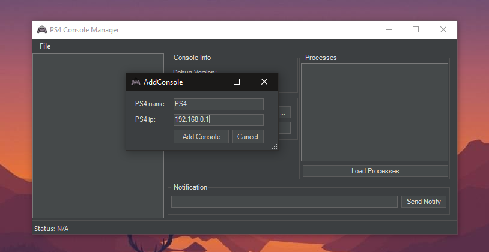
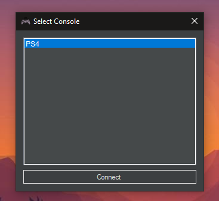

libdebug Edited 
I was bored wanted to start looking at some PS4 stuff. 

This DLL is just a edited version of [jogolden](https://github.com/jogolden/ps4debug) dll on his page!
All i have added so far is when you setup connection you dont need to specify ip
Consoles ip/name will be handled thru a ui/console manager saving to the registery
I am using his ps4debug.bin payload for connecting

Will add more stuff to it later




```cpp
//To Connect in C# inside button do

ps4.Connect();
```
This will load a Form for you to select a console from your list, instead of needing to have a ip box



